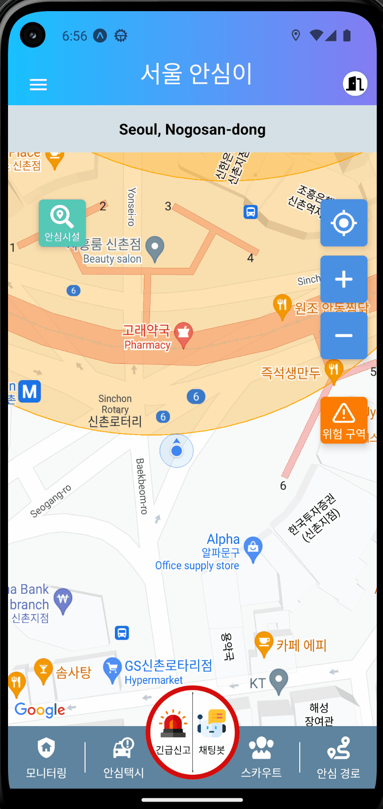

# 안심이 App Clone with Enhanced Features

## Overview
This project is a frontend clone of the 서울시 안심이 app, recreated using React Native and Expo. It aims to replicate the original app's interface with several functional and design adjustments. The goal is to showcase new functionalities that enhance user safety and experience.

## Features
1. **Dangerous Area Indication**:
   - The app displays orange circles on the map to indicate areas where accidents have occurred.
   - Users can tap on these circles to view detailed information about the accident.

2. **Safe Routing**:
   - The app offers safe routing options to help users reach their destination while avoiding dangerous areas.

3. **Emergency Chatbot**:
   - A chatbot feature provides advice and responses for emergency situations, including direct contact to the the police or an ambulance without phone calling.

4. **Social Worker Assistance**:
   - Users can find and contact nearby social workers who can guide them through potentially dangerous areas, offering additional safety, especially at night.

## Installation and Setup
Clone the repository and install dependencies:
```bash
git clone https://github.com/BlownSugar/DangerArea/
cd DangerArea
npm install
```

To run the app, use:
```bash
expo start
```

## Usage
The entire application logic is contained within `App.js`. 

## Demonstration





## Acknowledgements
This project is inspired by the original 서울시 안심이 app. All new functionalities are purely demonstrative and are designed for showcasing purposes.
